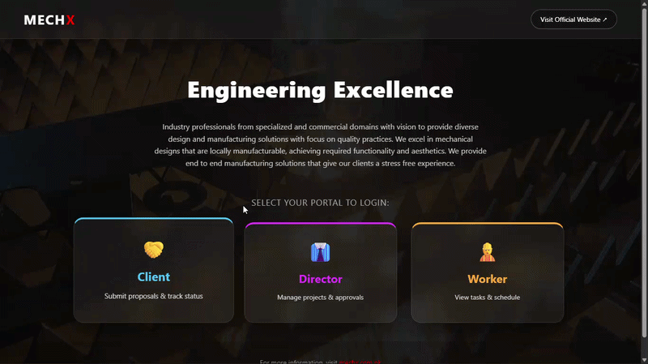
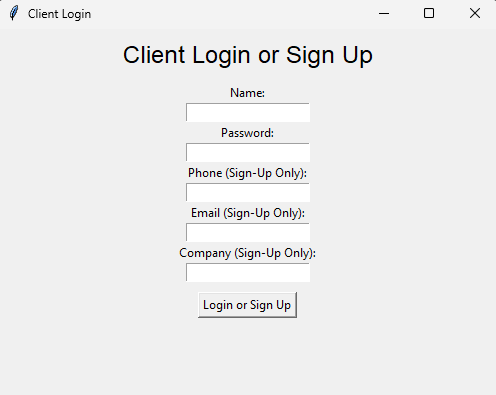
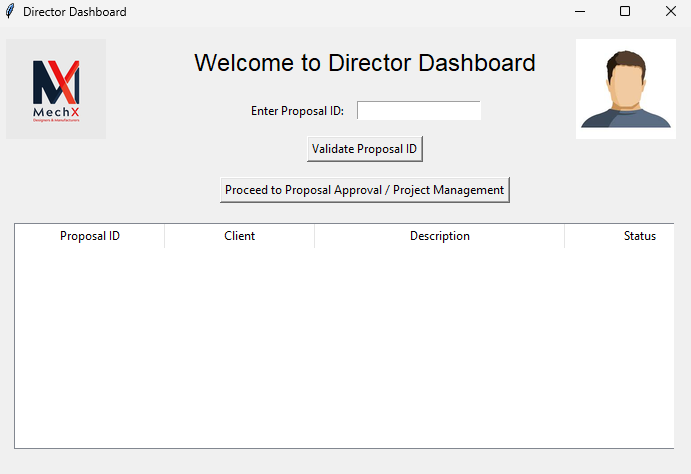
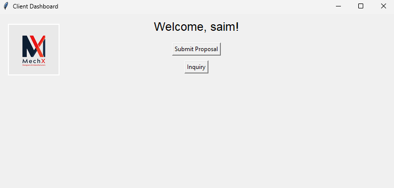
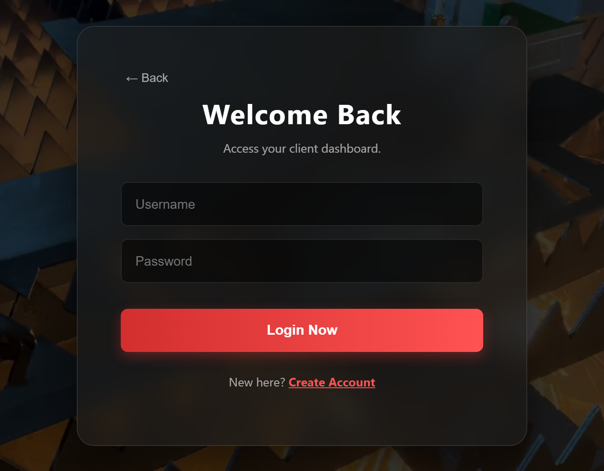
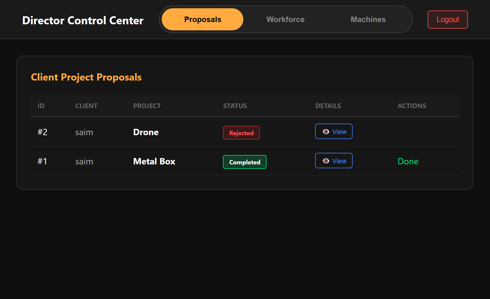
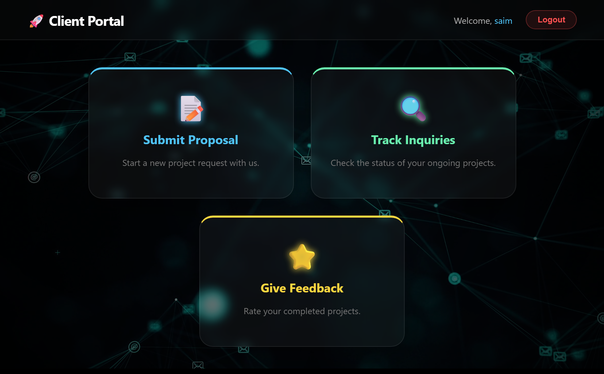
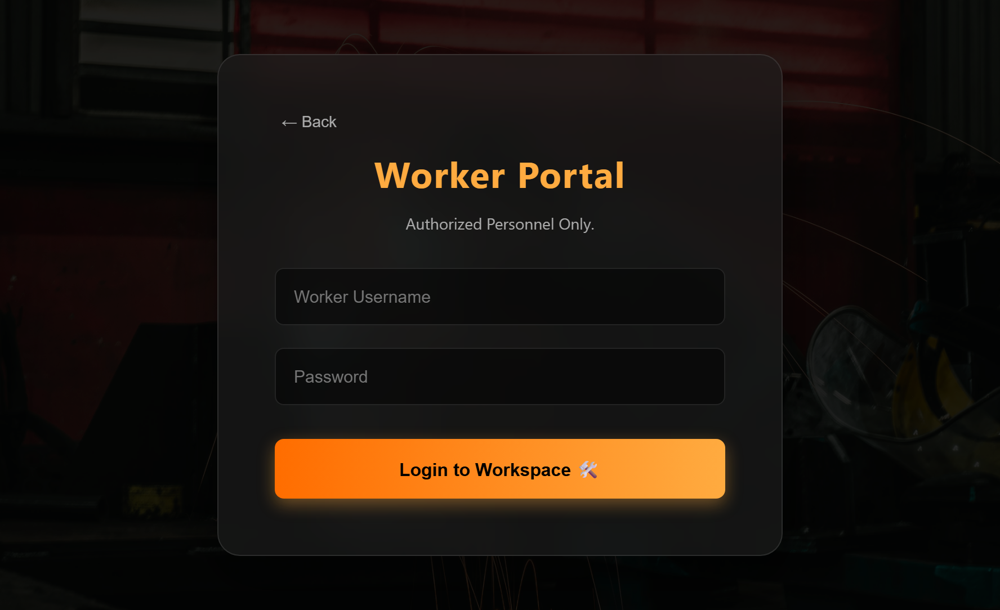

# Design-to-Delivery (D2D) Industrial Process Management System

The **D2D Industrial Process Management System** is a professional-grade ERP (Enterprise Resource Planning) suite designed to digitize the end-to-end lifecycle of a manufacturing business. This project represents a comprehensive digital transformation—migrating an industrial workflow from fragmented manual records to a centralized, role-based digital ecosystem.

Developed by **Fahaz Khan**.

-----

## 🔗 Live Demo
* **Frontend (Vercel):** [https://d2d-industrial-management.vercel.app/](https://d2d-industrial-management.vercel.app/)
  
-----
## 🎥 Demo & Preview

### ▶️ Full Video Walkthrough
👉 [Click Here](https://drive.google.com/file/d/1CYwQe0fMs3zPnThM3yZEpM54O2qyyTaf/view?usp=sharing)

### ⚡ Quick Preview
<p align="center">
  
</p>

-----

### 🖥️ Desktop Prototype (V1)

<p align="center">
  
  
</p>

<p align="center">
  
</p>

-----

### 🌐 Web Production (V2)

<p align="center">
  
  
</p>

<p align="center">
  
  
</p>

-----

## 🏗️ The Problem

Small-to-medium manufacturing firms often suffer from **Information Silos**. When design specifications, vendor procurement, and warehouse inventory are handled via separate manual channels, the result is:

  * **Operational Opacity:** Difficulty tracking a project's exact stage in real-time.
  * **Financial Inaccuracy:** High risk of error in calculating material overhead and labor costs.
  * **Process Bottlenecks:** Delays in hand-offs between Design, Procurement, and Manufacturing teams.

-----

## 🚀 Key Features

  * **Role-Based Access Control (RBAC):** Tailored dashboards for **Clients**, **Workers**, and **Directors**.
  * **Full Lifecycle Visibility:** Real-time tracking from **Inquiry → Design → Procurement → Assembly → Packaging → Delivery**.
  * **Resource & Machine Logging:** Precision tracking of equipment utilization and worker hours to optimize shop-floor productivity.
  * **Automated Cost Analysis:** Integrated financial module for calculating project margins and vendor payments.
  * **Logistics & Feedback Loop:** Complete "Last Mile" tracking with integrated client feedback for quality assurance.

-----

## 🧠 Architectural Evolution

This repository showcases a two-stage engineering evolution, reflecting advanced learning in software architecture and database management.

### **Phase 1: The Desktop Prototype (Legacy)**

*The initial functional prototype developed in Python/Tkinter.*

  * **Tech Stack:** Python, Tkinter, SQLite.
  * **Hardware Environment:** Developed and tested on a **Dell Latitude E6420**.
  * **Focus:** Validating the "Design to Delivery" pipeline and defining the initial relational data schema.

### **Phase 2: The Modern Web Suite (Production)**

*Modern, responsive dashboards built with React and Tailwind CSS.*

  * **Tech Stack:** React.js (Frontend), Python/Flask (RESTful API), SQLite (Relational Backend).
  * **Architectural Shift:** Transitioned to a **Decoupled Client-Server** model to allow for multi-user access across factory-floor tablets and office workstations.
  * **Automation:** Implemented automated database initialization and `row_factory` serialization for seamless JSON communication.

-----

## 🛠️ Technical Stack

| Category | Tools & Technologies |
| :--- | :--- |
| **Frontend** | React.js, CSS3 (Modern UI/UX with Dark Mode) |
| **Backend** | Python, Flask (RESTful API Design) |
| **Database** | SQLite (Normalized Relational Schema) |
| **DevOps** | Git, GitHub (Advanced Version Control & .gitignore optimization) |
| **Documentation** | UML (Use Case, Object Diagrams), Technical Reports |

-----

## 📁 Repository Structure

```text
d2d-industrial-management/
├── v2-web-production/       # Modern React + Flask Suite
│   ├── client-ui/           # React.js Frontend
│   └── server/              # Flask API & SQLite Backend
├── v1-desktop-prototype/    # Legacy Python/Tkinter Prototype
├── docs/                    # Technical Reports & UML Diagrams
│   └── diagrams/            # ERD and Workflow Visuals
├── assets/                  # UI Screenshots & System Demo GIFs
└── README.md                # Project Documentation
```

-----

## ⚙️ Installation & Setup

### **Version 2 (Web App)**

1.  **Backend:**
   
    ```bash
    cd v2-web-production/server
    pip install -r requirements.txt
    python server.py
    ```
2.  **Frontend:**
   
    ```bash
    cd v2-web-production/client-ui
    npm install
    npm start
    ```

### **Version 1 (Desktop)**

1.  Navigate to `v1-desktop-prototype/`.
2.  Run `python main_director.py` or `python main_client.py`.

-----

## 📄 Documentation

Detailed technical documentation is available in the `/docs` folder:

  * `D2D_V1_Database_Design_Report.pdf`: Deep dive into relational mapping.
  * `D2D_V2_Full_System_Production_Report.pdf`: Full Software Engineering Process documentation.
  * **Diagrams:** Swimlane workflows and Object diagrams explaining the system logic.

-----

## 👤 Author
**Muhammad Fahaz Khan**  
- **GitHub:** [@SHADOWRULIN](https://github.com/SHADOWRULIN)  
- **LinkedIn:** [Fahaz Khan](https://www.linkedin.com/in/muhammadfahazkhan/)
  
-----

## 📜 License

This project is licensed under the **MIT License**.
